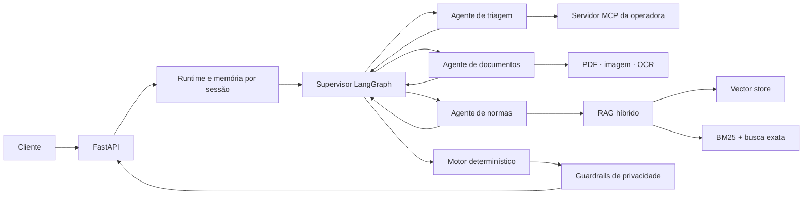

# Agente Inteligente de Reembolso

Projeto de IA aplicado à análise de solicitações de reembolso em saúde. A solução combina arquitetura multiagente, leitura de documentos, consulta cadastral via MCP, recuperação híbrida de normas e cálculo determinístico das regras de negócio.

> Projeto educacional com dados fictícios. Não deve ser utilizado para decisões reais de saúde ou cobertura sem revisão humana e controles adequados à LGPD.

[Explorar o código](./reembolso-bootcamp-2026/) · [Documentação completa](./reembolso-bootcamp-2026/README.md) · [Testes](./reembolso-bootcamp-2026/tests/)

## Destaques

- supervisor e handoffs explícitos implementados com LangGraph;
- agentes especializados em triagem, documentos e normas;
- memória conversacional isolada por `session_id`;
- integração com a operadora por Model Context Protocol;
- leitura de PDFs e imagens com extração estruturada e OCR;
- RAG híbrido com vector store, BM25, busca exata, RRF e reranqueamento;
- cálculo financeiro determinístico com `Decimal`;
- guardrails para CPF, CID e solicitações envolvendo terceiros;
- API FastAPI tipada com Pydantic;
- suíte automatizada com 37 testes.

## Arquitetura



O modelo de linguagem é usado onde interpretação semântica agrega valor. Validação, cálculo monetário, limites, coparticipação, carência e transições previsíveis permanecem em código determinístico.

## Tecnologias

| Área | Tecnologias |
|---|---|
| Linguagem e API | Python 3.11, FastAPI, Uvicorn, Pydantic |
| Agentes | LangGraph, LangChain |
| IA generativa | Gemini 2.5 Flash Lite por gateway compatível |
| RAG | LlamaIndex, vector store embarcado, BM25, RRF |
| Documentos | PyMuPDF, Pillow, Tesseract OCR, python-docx |
| Integração | Model Context Protocol, HTTPX |
| Qualidade | pytest, unittest, configuração Pyright |
| Infraestrutura | Docker e Docker Compose |

## Fluxo de processamento

1. A API recebe a mensagem e um anexo opcional.
2. O supervisor recupera o estado da sessão e escolhe o agente especialista.
3. A triagem consulta cadastro e histórico pelo MCP.
4. O agente documental classifica e extrai dados do comprovante.
5. O agente de normas recupera evidências da base de conhecimento.
6. O motor determinístico calcula elegibilidade, decisão e valores.
7. Os guardrails sanitizam a resposta antes de devolvê-la ao cliente.

## Como executar

Entre no diretório do projeto:

```bash
cd reembolso-bootcamp-2026
```

Crie o arquivo de configuração:

```bash
cp .env.example .env
```

No PowerShell:

```powershell
Copy-Item .env.example .env
```

Preencha no `.env` as variáveis `BOOTCAMP_LLM_ENDPOINT` e `BOOTCAMP_API_KEY`. Credenciais reais nunca devem ser adicionadas ao Git.

Suba a aplicação e o servidor MCP:

```bash
docker compose up --build
```

Serviços disponíveis:

- API: `http://localhost:8000`;
- Swagger UI: `http://localhost:8000/docs`;
- MCP: `http://localhost:9000/mcp`.

Teste a saúde da API:

```bash
curl http://localhost:8000/health
```

## Exemplo de uso

```bash
curl -X POST http://localhost:8000/chat \
  -H "Content-Type: application/json" \
  -d '{
    "session_id": "exemplo-01",
    "mensagem": "Quero solicitar um reembolso"
  }'
```

A resposta pode incluir categoria documental, decisão, valores calculados, regras aplicadas, protocolo e pendências.

## Testes

```bash
cd reembolso-bootcamp-2026
python -m pip install -r requirements-dev.txt
python -m pytest -q
```

A suíte cobre cálculo, contratos HTTP, privacidade, integração MCP, persistência da sessão, roteamento do grafo, documentos e recuperação híbrida.

## Organização

```text
reembolso-bootcamp-2026/
├── app/                 # API, grafo, agentes, RAG, cálculo e guardrails
├── ingest/              # construção dos índices
├── kb/                  # base normativa
├── storage/             # índices persistidos
├── mcp/                 # simulador da operadora
├── casos_treino/        # cenários fictícios
├── anexos/treino/       # documentos fictícios
└── tests/               # testes automatizados
```

Consulte a [documentação detalhada](./reembolso-bootcamp-2026/README.md) para instalação local sem Docker, contratos completos da API, configuração, reconstrução do índice RAG e limitações conhecidas.

## Licença

Distribuído sob a [licença MIT](./LICENSE).
