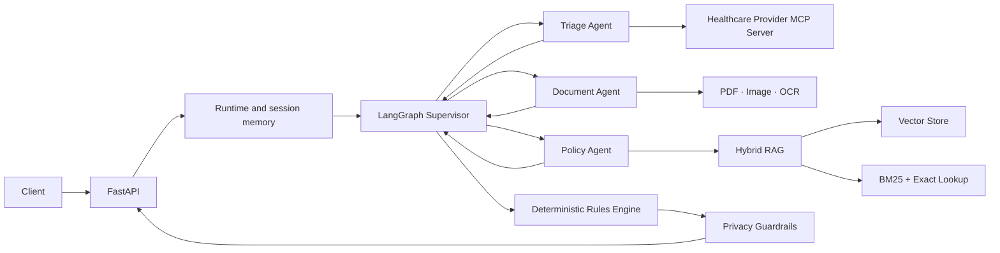

# AI-Powered Healthcare Reimbursement Agent

**A multi-agent conversational system for healthcare reimbursement analysis, combining document understanding, eligibility checks, hybrid RAG, and deterministic financial rules.**

`Python 3.11` · `FastAPI` · `LangGraph` · `LlamaIndex` · `MCP` · `Pydantic` · `Docker`

Built during the **Triggo.ai AI Engineering Bootcamp**.

[Explore the source code](./reembolso-bootcamp-2026/) · [Technical documentation](./reembolso-bootcamp-2026/README.md) · [Test suite](./reembolso-bootcamp-2026/tests/)

## Overview

Healthcare reimbursement requests require information that often arrives across multiple interactions: member identification, invoices, clinical documents, usage history, policy rules, and financial limits.

This project turns that workflow into a conversational API capable of:

- preserving context across multiple turns;
- routing each step to a specialized agent;
- interpreting receipts, invoices, reports, and images;
- querying member data and reimbursement history through MCP;
- retrieving evidence from a regulatory knowledge base;
- calculating decisions and reimbursement amounts reproducibly;
- protecting personal and clinical data in the final response.

All demonstration data and documents are synthetic.

## What this project demonstrates

| Capability | Implementation |
|---|---|
| Agent architecture | LangGraph supervisor with explicit handoffs to triage, document, and policy agents |
| RAG engineering | Vector search + BM25 + exact rule lookup + Reciprocal Rank Fusion |
| Systems integration | Authenticated Model Context Protocol client and server |
| Document AI | PDF and image extraction with PyMuPDF, Pillow, and Tesseract OCR |
| Business rules | Deterministic engine using `Decimal`, dates, coverage limits, and copay rules |
| Structured data | Boundary validation and typed contracts with Pydantic |
| Privacy | Guardrails for tax IDs, diagnosis codes, membership IDs, and third-party requests |
| Software quality | 37 automated tests, type-checking configuration, and pinned dependencies |
| Delivery | Containerized FastAPI application orchestrated with Docker Compose |

## Architecture



## Key technical decisions

### Specialized agents with explicit responsibilities

The supervisor does not attempt to solve the entire workflow by itself. It preserves the session state and delegates work to dedicated agents:

- **Triage:** member identification, eligibility, and reimbursement history;
- **Documents:** attachment classification and structured field extraction;
- **Policy:** retrieval and interpretation of regulatory evidence.

### AI for interpretation, code for guarantees

The language model handles semantic tasks. Monetary calculations, validation, waiting periods, coverage limits, copay rules, and predictable state transitions remain deterministic.

This separation reduces hallucinations and makes financial outcomes testable.

### Hybrid retrieval

The retrieval pipeline combines:

- vector similarity for semantic context;
- BM25 for lexical relevance;
- exact lookup for policy articles, circulars, and procedure codes;
- rank fusion and reranking based on authority and effective date.

### Privacy by design

Privacy is not enforced through prompting alone. Deterministic checks also prevent the disclosure of tax IDs, diagnosis codes, membership IDs, and third-party data.

## Request flow

1. The API receives a message and an optional attachment.
2. Conversation state is restored using the `session_id`.
3. The supervisor selects the appropriate specialist for the turn.
4. Member data, document fields, and policy evidence are consolidated.
5. The deterministic engine calculates the outcome when enough data is available.
6. Privacy guardrails sanitize the response before it reaches the client.

## Tech stack

| Area | Technologies |
|---|---|
| API | Python 3.11, FastAPI, Uvicorn, Pydantic |
| Agents | LangGraph, LangChain |
| Generative AI | Gemini 2.5 Flash Lite through a compatible gateway |
| Retrieval | LlamaIndex, embedded vector store, BM25, RRF |
| Documents | PyMuPDF, Pillow, Tesseract OCR, python-docx |
| Integration | Model Context Protocol, HTTPX |
| Quality | pytest, unittest, Pyright configuration |
| Infrastructure | Docker and Docker Compose |

## API

```http
GET  /health
POST /chat
POST /reset
```

Example request:

```json
{
  "session_id": "portfolio-demo",
  "mensagem": "I want to request reimbursement for a medical appointment",
  "anexo": null
}
```

The structured response may include document category, decision, requested amount, calculated reimbursement, applied rules, protocol number, and pending requirements.

> The request and response field names remain in Portuguese to preserve the original API contract.

## Quality and validation

The automated suite covers:

- financial calculations and business rules;
- HTTP contracts;
- session persistence and isolation;
- graph routing and agent handoffs;
- document extraction;
- hybrid retrieval;
- MCP integration;
- privacy and response sanitization.

Current result: **37 tests passing**.

## Run the project

```bash
cd reembolso-bootcamp-2026
cp .env.example .env
docker compose up --build
```

After configuring the local credentials:

- API: `http://localhost:8000`;
- Swagger UI: `http://localhost:8000/docs`;
- MCP server: `http://localhost:9000/mcp`.

Local installation, environment variables, complete API examples, and RAG index reconstruction are covered in the [technical documentation](./reembolso-bootcamp-2026/README.md).

## Project structure

```text
reembolso-bootcamp-2026/
├── app/                 # API, agents, RAG, rules engine, and guardrails
├── ingest/              # index construction pipeline
├── kb/                  # regulatory knowledge base
├── storage/             # persisted retrieval indexes
├── mcp/                 # simulated healthcare provider integration
├── casos_treino/        # synthetic conversation scenarios
├── anexos/treino/       # synthetic documents
└── tests/               # automated test suite
```

## License

Distributed under the [MIT License](./LICENSE).
