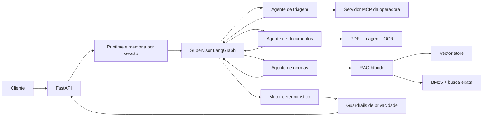

# Agente Inteligente de Reembolso

**Sistema conversacional multiagente para análise de reembolsos em saúde, com interpretação de documentos, consulta cadastral, RAG híbrido e cálculo determinístico.**

`Python 3.11` · `FastAPI` · `LangGraph` · `LlamaIndex` · `MCP` · `Pydantic` · `Docker`

[Ver código-fonte](./reembolso-bootcamp-2026/) · [Documentação técnica](./reembolso-bootcamp-2026/README.md) · [Suíte de testes](./reembolso-bootcamp-2026/tests/)

## Visão geral

Solicitações de reembolso exigem combinar informações que chegam em momentos diferentes: identificação do beneficiário, documentos fiscais, histórico de utilização, regras contratuais e limites financeiros.

Este projeto transforma esse fluxo em uma API conversacional capaz de:

- manter o contexto entre diferentes turnos;
- encaminhar cada etapa para um agente especialista;
- interpretar recibos, notas fiscais, relatórios e imagens;
- consultar cadastro e histórico em um servidor MCP;
- recuperar evidências de uma base normativa;
- calcular decisões e valores de forma reproduzível;
- proteger dados pessoais e informações clínicas na resposta.

Os dados e documentos usados na demonstração são sintéticos.

## Competências demonstradas

| Competência | Implementação |
|---|---|
| Arquitetura de agentes | Supervisor LangGraph com handoffs explícitos para triagem, documentos e normas |
| Engenharia de RAG | Busca vetorial + BM25 + busca por dispositivo + Reciprocal Rank Fusion |
| Integração de sistemas | Cliente e servidor Model Context Protocol com autenticação |
| Document AI | Extração de PDF e imagem com PyMuPDF, Pillow e Tesseract OCR |
| Regras de negócio | Motor determinístico com `Decimal`, datas, tetos e coparticipação |
| Dados estruturados | Contratos e validação de fronteira com Pydantic |
| Privacidade | Guardrails para CPF, CID, carteirinha e solicitações sobre terceiros |
| Qualidade | 37 testes automatizados, tipagem e dependências fixadas |
| Entrega | API FastAPI conteinerizada com Docker Compose |

## Arquitetura



## Decisões técnicas

### Multiagente com responsabilidades claras

O supervisor não tenta resolver tudo sozinho. Ele preserva o estado da sessão e transfere o trabalho para agentes especializados:

- **Triagem:** identificação, elegibilidade e histórico do beneficiário;
- **Documentos:** classificação e extração de campos do anexo;
- **Normas:** recuperação e interpretação de evidências regulatórias.

### IA para interpretação, código para garantias

O modelo de linguagem é usado nas tarefas semânticas. Cálculo monetário, validação, limites, carência, coparticipação e transições previsíveis permanecem em código determinístico.

Isso reduz respostas inventadas e torna os resultados financeiros testáveis.

### RAG híbrido

A recuperação combina:

- similaridade vetorial para contexto semântico;
- BM25 para correspondência lexical;
- busca exata por artigos, circulares e códigos TUSS;
- fusão de rankings e reranqueamento por autoridade e vigência da norma.

### Privacidade desde a arquitetura

A aplicação não apenas orienta o modelo por prompt. Também aplica verificações determinísticas para impedir exposição de CPF, CID e dados de terceiros.

## Fluxo de uma solicitação

1. A API recebe uma mensagem e um anexo opcional.
2. O estado da conversa é recuperado pelo `session_id`.
3. O supervisor seleciona o agente responsável pelo turno.
4. Cadastro, documentos e normas são consolidados no estado.
5. O motor determinístico calcula a decisão quando existem dados suficientes.
6. Os guardrails sanitizam a resposta antes do retorno ao cliente.

## Stack

| Área | Tecnologias |
|---|---|
| API | Python 3.11, FastAPI, Uvicorn, Pydantic |
| Agentes | LangGraph, LangChain |
| IA generativa | Gemini 2.5 Flash Lite por gateway compatível |
| Recuperação | LlamaIndex, vector store embarcado, BM25, RRF |
| Documentos | PyMuPDF, Pillow, Tesseract OCR, python-docx |
| Integração | Model Context Protocol, HTTPX |
| Qualidade | pytest, unittest, configuração Pyright |
| Infraestrutura | Docker e Docker Compose |

## API

```http
GET  /health
POST /chat
POST /reset
```

Exemplo de turno:

```json
{
  "session_id": "portfolio-demo",
  "mensagem": "Quero solicitar o reembolso de uma consulta",
  "anexo": null
}
```

A resposta pode incluir categoria documental, decisão, valor solicitado, valor calculado, regras aplicadas, protocolo e pendências.

## Qualidade e validação

A suíte automatizada cobre:

- cálculo e regras de negócio;
- contratos HTTP;
- persistência e isolamento das sessões;
- roteamento e handoffs do grafo;
- extração documental;
- recuperação híbrida;
- cliente MCP;
- privacidade e sanitização.

Resultado atual: **37 testes aprovados**.

## Executar o projeto

```bash
cd reembolso-bootcamp-2026
cp .env.example .env
docker compose up --build
```

Após configurar as credenciais locais:

- API: `http://localhost:8000`;
- Swagger UI: `http://localhost:8000/docs`;
- MCP: `http://localhost:9000/mcp`.

A instalação local, as variáveis de ambiente, os exemplos completos e a reconstrução da base RAG estão na [documentação técnica](./reembolso-bootcamp-2026/README.md).

## Estrutura principal

```text
reembolso-bootcamp-2026/
├── app/                 # API, agentes, RAG, cálculo e guardrails
├── ingest/              # construção dos índices
├── kb/                  # base normativa
├── storage/             # índices persistidos
├── mcp/                 # integração simulada com a operadora
├── casos_treino/        # cenários sintéticos
├── anexos/treino/       # documentos sintéticos
└── tests/               # testes automatizados
```

## Licença

Distribuído sob a [licença MIT](./LICENSE).
