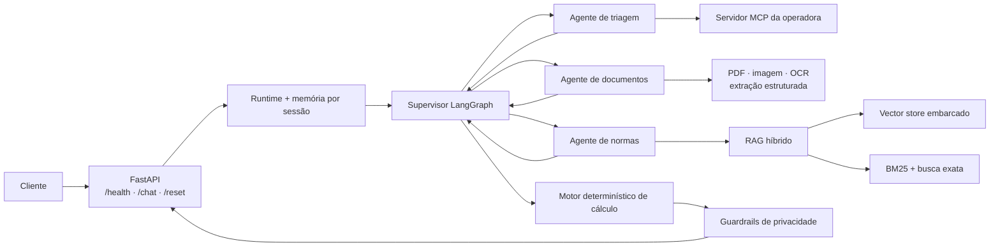

# Agente Inteligente de Reembolso

API conversacional para análise de solicitações de reembolso em saúde. O projeto combina uma arquitetura multiagente, consulta cadastral via MCP, leitura de documentos, recuperação híbrida de normas e um motor determinístico para calcular a decisão e o valor do reembolso.

> Projeto educacional. Os dados dos casos de treino são fictícios e a aplicação não deve ser usada para decisões reais de saúde ou de cobertura sem revisão humana, controles operacionais e adequação à LGPD.

## Principais recursos

- orquestração explícita de agentes com LangGraph;
- memória de conversa isolada por `session_id`;
- triagem e consulta de beneficiários por um servidor MCP local;
- leitura de PDF e imagem com PyMuPDF, Pillow e Tesseract OCR;
- extração estruturada e validação com Pydantic;
- RAG híbrido com busca vetorial, BM25, Reciprocal Rank Fusion e reranqueamento por autoridade normativa;
- cálculo financeiro determinístico com `Decimal`;
- guardrails contra exposição de CPF, CID e dados de terceiros;
- API FastAPI com contratos tipados e documentação OpenAPI;
- execução local ou com Docker Compose.

## Arquitetura



O supervisor escolhe o especialista adequado a cada turno e consolida os fatos retornados. Regras de negócio como tetos, coparticipação, carência, limite anual e escalonamento são executadas em código, sem delegar aritmética ao modelo de linguagem.

### Componentes

| Componente | Responsabilidade |
|---|---|
| `app/main.py` | Expõe a API HTTP e valida as requisições. |
| `app/agents/supervisor/` | Mantém o estado da sessão, faz handoffs e consolida a resposta. |
| `app/agents/triagem/` | Valida a carteirinha e consulta cadastro e histórico pelo MCP. |
| `app/agents/documento/` | Classifica anexos e extrai os campos necessários. |
| `app/agents/normas/` | Recupera evidências da base normativa para responder dúvidas. |
| `app/calculo/` | Aplica regras determinísticas de elegibilidade e cálculo. |
| `app/rag/` | Combina recuperação densa, BM25, busca por dispositivo e reranqueamento. |
| `app/guardrails/` | Detecta solicitações sobre terceiros e sanitiza dados sensíveis. |
| `mcp/` | Simula a integração externa com a operadora. |
| `ingest/` | Extrai a base documental e reconstrói os índices persistidos. |

## Tecnologias

| Área | Tecnologias |
|---|---|
| Linguagem e API | Python 3.11, FastAPI, Uvicorn, Pydantic |
| Agentes | LangGraph, LangChain |
| IA generativa | Gemini 2.5 Flash Lite por gateway compatível |
| RAG | LlamaIndex, vector store embarcado, BM25 |
| Documentos | PyMuPDF, Pillow, Tesseract OCR, python-docx |
| Integração | Model Context Protocol (MCP), HTTPX |
| Qualidade | pytest, unittest, configuração Pyright |
| Infraestrutura | Docker, Docker Compose |

As versões usadas estão fixadas em `requirements.txt` e `mcp/requirements.txt` para tornar a instalação reproduzível.

## Estrutura do repositório

```text
.
├── app/                 # API, grafo, agentes, RAG, cálculo e guardrails
├── ingest/              # pipeline de ingestão e construção do índice
├── kb/                  # base normativa usada pelo RAG
├── storage/             # índices persistidos carregados pela aplicação
├── mcp/                 # servidor MCP local da operadora
├── casos_treino/        # conversas e resultados esperados fictícios
├── anexos/treino/       # documentos fictícios usados nos cenários
├── avaliacao/           # utilitários do simulador de conversas
├── tests/               # testes unitários, de contrato e de integração local
├── Dockerfile
└── docker-compose.yml
```

## Pré-requisitos

- Python 3.11;
- Docker e Docker Compose, para a execução recomendada;
- credenciais válidas para o gateway configurado em `BOOTCAMP_LLM_ENDPOINT`;
- Tesseract OCR e Poppler quando a aplicação for executada sem Docker.

## Configuração

Crie o arquivo local de configuração a partir do exemplo:

```bash
cp .env.example .env
```

No PowerShell:

```powershell
Copy-Item .env.example .env
```

Preencha somente o `.env`. Ele é ignorado pelo Git e não deve ser publicado.

| Variável | Obrigatória | Descrição |
|---|---:|---|
| `BOOTCAMP_LLM_ENDPOINT` | Sim | URL-base do gateway de chat e embeddings. |
| `BOOTCAMP_API_KEY` | Sim | Credencial do gateway. Trate como segredo. |
| `MCP_OPERADORA_URL` | Sim | Endpoint HTTP do servidor MCP. |
| `MCP_OPERADORA_TOKEN` | Localmente | Token do MCP; `treino` é apenas o valor do simulador local. |

## Como executar

### Opção 1 — Docker Compose

Com o `.env` configurado:

```bash
docker compose up --build
```

Os serviços ficam disponíveis em:

- API: `http://localhost:8000`;
- documentação interativa: `http://localhost:8000/docs`;
- MCP: `http://localhost:9000/mcp`.

Verifique a aplicação:

```bash
curl http://localhost:8000/health
```

Resposta esperada:

```json
{"status":"ok"}
```

### Opção 2 — execução local

Crie e ative o ambiente virtual:

```bash
python3.11 -m venv .venv
source .venv/bin/activate
python -m pip install -r requirements.txt
```

No PowerShell:

```powershell
py -3.11 -m venv .venv
.\.venv\Scripts\Activate.ps1
python -m pip install -r requirements.txt
```

Para desenvolvimento e execução dos testes, instale também:

```bash
python -m pip install -r requirements-dev.txt
```

Em um terminal, suba o MCP a partir da raiz do projeto:

```bash
PYTHONPATH=mcp MCP_OPERADORA_DADOS=casos_treino MCP_OPERADORA_TOKEN=treino \
  python -m mcp_operadora.server
```

Equivalente no PowerShell:

```powershell
$env:PYTHONPATH = "mcp"
$env:MCP_OPERADORA_DADOS = "casos_treino"
$env:MCP_OPERADORA_TOKEN = "treino"
python -m mcp_operadora.server
```

Em outro terminal, suba a API:

```bash
uvicorn app.main:app --host 0.0.0.0 --port 8000
```

## Uso da API

### `GET /health`

Retorna o estado básico do serviço.

### `POST /chat`

Processa um turno e preserva o contexto pelo `session_id`:

```bash
curl -X POST http://localhost:8000/chat \
  -H "Content-Type: application/json" \
  -d '{
    "session_id": "exemplo-01",
    "mensagem": "Quero solicitar um reembolso. Minha carteirinha é 7042 8813 5561 0029"
  }'
```

Um anexo opcional usa o formato:

```json
{
  "filename": "recibo.pdf",
  "mime_type": "application/pdf",
  "base64": "<conteudo-em-base64>"
}
```

A resposta inclui texto conversacional e, quando houver dados suficientes, categoria, decisão, valores, regras aplicadas, protocolo e pendências.

### `POST /reset`

Remove os estados de conversa mantidos em memória:

```bash
curl -X POST http://localhost:8000/reset
```

## Testes e validação

Execute a suíte automatizada sem depender dos serviços externos:

```bash
python -m pip install -r requirements-dev.txt
python -m pytest -q
```

Os testes cobrem o motor de cálculo, contratos da API, privacidade, cliente MCP, memória e roteamento do grafo, extração documental e recuperação híbrida.

Para executar as conversas completas de treino, mantenha o MCP e a API ativos:

```bash
python rodar_treino.py --roteiro-fixo
python rodar_treino.py --caso 02 -v
```

O avaliador conversacional também usa o gateway configurado no `.env`.

## Reconstrução da base RAG

O índice em `storage/` já acompanha o projeto. Reconstrua-o somente quando o conteúdo de `kb/` mudar:

```bash
python -m ingest.build
```

Esse processo usa o serviço de embeddings configurado no `.env`, persiste o vector store, o índice BM25, o catálogo de procedimentos e um manifesto com hashes das fontes.

## Segurança e privacidade

- nunca adicione `.env`, chaves, tokens ou credenciais reais ao Git;
- mantenha apenas placeholders em `.env.example`;
- rotacione imediatamente qualquer segredo que tenha sido enviado a um commit ou compartilhado publicamente;
- revise anexos e bases documentais antes de substituir os exemplos fictícios por novos arquivos;
- em produção, substitua a memória em processo e o MCP de treino por serviços persistentes e controles de autenticação, autorização, auditoria e retenção adequados.

Antes do primeiro push, confirme que o arquivo de segredo continua ignorado:

```bash
git check-ignore -v .env
git status --short
```

## Limitações conhecidas

- o estado das sessões usa `InMemorySaver` e é perdido ao reiniciar o processo;
- o bloqueio do runtime prioriza consistência, não processamento paralelo de alto volume;
- o MCP incluído é um simulador local com dados fictícios;
- a execução completa depende de um gateway compatível para chat e embeddings.

## Licença

Distribuído sob a licença MIT. Consulte o arquivo [`LICENSE`](LICENSE).
