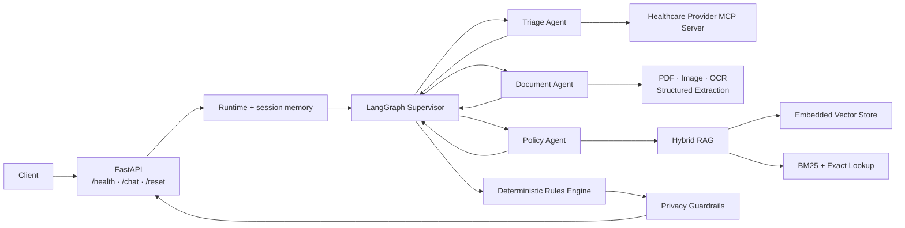

# AI-Powered Healthcare Reimbursement Agent

A conversational API for healthcare reimbursement analysis. The project combines multi-agent orchestration, member data retrieval through MCP, document understanding, hybrid policy retrieval, and a deterministic engine for reimbursement decisions and calculations.

Built during the **Triggo.ai AI Engineering Bootcamp**.

> Portfolio project using synthetic members and documents. It is not intended for real healthcare or coverage decisions without human review, production controls, and applicable privacy compliance.

## Core capabilities

- explicit multi-agent orchestration with LangGraph;
- isolated conversation memory for each `session_id`;
- member eligibility and reimbursement history through a local MCP server;
- PDF and image processing with PyMuPDF, Pillow, and Tesseract OCR;
- structured extraction and boundary validation with Pydantic;
- hybrid RAG using vector search, BM25, Reciprocal Rank Fusion, and policy-aware reranking;
- deterministic financial calculations using `Decimal`;
- privacy guardrails for tax IDs, diagnosis codes, membership IDs, and third-party requests;
- typed FastAPI contracts and OpenAPI documentation;
- local and containerized execution.

## Architecture



The supervisor selects the appropriate specialist for each turn and consolidates validated facts. Coverage limits, copay rates, waiting periods, annual limits, and escalation rules are executed in deterministic code instead of being delegated to the language model.

### Components

| Component | Responsibility |
|---|---|
| `app/main.py` | Exposes the HTTP API and validates requests. |
| `app/agents/supervisor/` | Preserves session state, coordinates handoffs, and consolidates responses. |
| `app/agents/triagem/` | Validates membership IDs and queries member data and history through MCP. |
| `app/agents/documento/` | Classifies attachments and extracts the required fields. |
| `app/agents/normas/` | Retrieves policy evidence for coverage and reimbursement questions. |
| `app/calculo/` | Applies deterministic eligibility and financial rules. |
| `app/rag/` | Combines vector retrieval, BM25, exact rule lookup, and reranking. |
| `app/guardrails/` | Detects third-party requests and sanitizes sensitive data. |
| `mcp/` | Simulates the external healthcare provider integration. |
| `ingest/` | Extracts the knowledge base and rebuilds persisted indexes. |

## Tech stack

| Area | Technologies |
|---|---|
| Language and API | Python 3.11, FastAPI, Uvicorn, Pydantic |
| Agents | LangGraph, LangChain |
| Generative AI | Gemini 2.5 Flash Lite through a compatible gateway |
| Retrieval | LlamaIndex, embedded vector store, BM25, RRF |
| Documents | PyMuPDF, Pillow, Tesseract OCR, python-docx |
| Integration | Model Context Protocol, HTTPX |
| Quality | pytest, unittest, Pyright configuration |
| Infrastructure | Docker, Docker Compose |

Dependency versions are pinned in `requirements.txt` and `mcp/requirements.txt` for reproducible installation.

## Repository structure

```text
.
├── app/                 # API, graph, agents, RAG, rules engine, and guardrails
├── ingest/              # ingestion and index construction pipeline
├── kb/                  # policy knowledge base used by RAG
├── storage/             # persisted indexes loaded by the application
├── mcp/                 # local healthcare provider MCP server
├── casos_treino/        # synthetic conversations and expected outcomes
├── anexos/treino/       # synthetic documents used by the scenarios
├── avaliacao/           # conversation simulation utilities
├── tests/               # unit, contract, and local integration tests
├── Dockerfile
└── docker-compose.yml
```

## Prerequisites

- Python 3.11;
- Docker and Docker Compose for the recommended setup;
- valid credentials for the gateway configured in `BOOTCAMP_LLM_ENDPOINT`;
- Tesseract OCR and Poppler when running outside Docker.

## Configuration

Create a local configuration file:

```bash
cp .env.example .env
```

PowerShell:

```powershell
Copy-Item .env.example .env
```

Only place real credentials in `.env`. This file is ignored by Git and must never be published.

| Variable | Required | Description |
|---|---:|---|
| `BOOTCAMP_LLM_ENDPOINT` | Yes | Base URL for the chat and embedding gateway. |
| `BOOTCAMP_API_KEY` | Yes | Gateway credential. Treat it as a secret. |
| `MCP_OPERADORA_URL` | Yes | HTTP endpoint for the MCP server. |
| `MCP_OPERADORA_TOKEN` | Locally | MCP token; `treino` is only used by the local simulator. |

## Run with Docker Compose

With `.env` configured:

```bash
docker compose up --build
```

Services:

- API: `http://localhost:8000`;
- interactive API documentation: `http://localhost:8000/docs`;
- MCP server: `http://localhost:9000/mcp`.

Health check:

```bash
curl http://localhost:8000/health
```

Expected response:

```json
{"status":"ok"}
```

## Run locally

Create and activate a virtual environment:

```bash
python3.11 -m venv .venv
source .venv/bin/activate
python -m pip install -r requirements.txt
```

PowerShell:

```powershell
py -3.11 -m venv .venv
.\.venv\Scripts\Activate.ps1
python -m pip install -r requirements.txt
```

Install development dependencies when running the test suite:

```bash
python -m pip install -r requirements-dev.txt
```

Start the MCP server from the repository root:

```bash
PYTHONPATH=mcp MCP_OPERADORA_DADOS=casos_treino MCP_OPERADORA_TOKEN=treino \
  python -m mcp_operadora.server
```

PowerShell:

```powershell
$env:PYTHONPATH = "mcp"
$env:MCP_OPERADORA_DADOS = "casos_treino"
$env:MCP_OPERADORA_TOKEN = "treino"
python -m mcp_operadora.server
```

In another terminal, start the API:

```bash
uvicorn app.main:app --host 0.0.0.0 --port 8000
```

## API

The original Portuguese field names are preserved as part of the public API contract.

### `GET /health`

Returns the basic service status.

### `POST /chat`

Processes one conversation turn and preserves context through `session_id`:

```bash
curl -X POST http://localhost:8000/chat \
  -H "Content-Type: application/json" \
  -d '{
    "session_id": "portfolio-demo",
    "mensagem": "Quero solicitar um reembolso"
  }'
```

Optional attachment structure:

```json
{
  "filename": "receipt.pdf",
  "mime_type": "application/pdf",
  "base64": "<base64-encoded-content>"
}
```

Once enough information is available, the response includes a conversational message, document category, decision, requested amount, reimbursement amount, applied rules, protocol number, and pending requirements.

### `POST /reset`

Clears all conversation states held in memory:

```bash
curl -X POST http://localhost:8000/reset
```

## Tests

Run the automated suite without external services:

```bash
python -m pip install -r requirements-dev.txt
python -m pytest -q
```

The tests cover the rules engine, API contracts, privacy, MCP client, graph memory and routing, document extraction, and hybrid retrieval.

Current result: **37 tests passing**.

To run the complete synthetic conversations, keep both the MCP server and API running:

```bash
python rodar_treino.py --roteiro-fixo
python rodar_treino.py --caso 02 -v
```

The conversation evaluator also uses the gateway configured in `.env`.

## Rebuild the RAG indexes

The persisted index in `storage/` is included in the project. Rebuild it only when the contents of `kb/` change:

```bash
python -m ingest.build
```

The pipeline uses the embedding service configured in `.env` and persists the vector store, BM25 index, procedure catalog, and a manifest containing source hashes.

## Security

- never commit `.env`, tokens, private keys, or real credentials;
- keep only placeholders in `.env.example`;
- rotate any secret that has been committed or shared publicly;
- review attachments and knowledge-base documents before replacing the synthetic examples;
- replace in-process memory and the local MCP simulator with persistent services, authentication, authorization, audit, and retention controls before production use.

Confirm that the local secret file remains ignored before a push:

```bash
git check-ignore -v .env
git status --short
```

## License

Distributed under the [MIT License](LICENSE).
